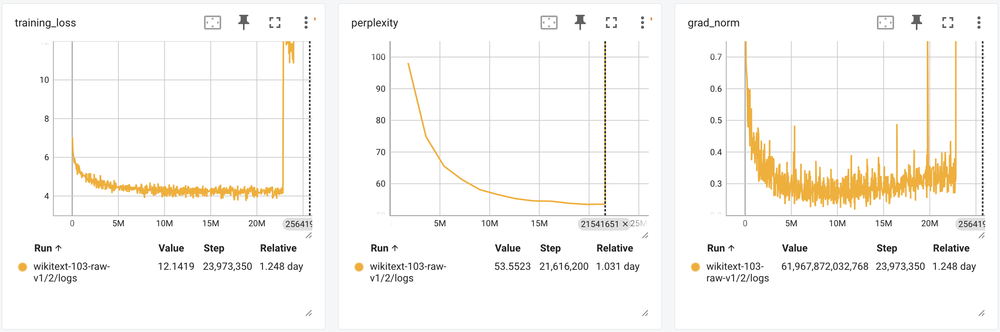
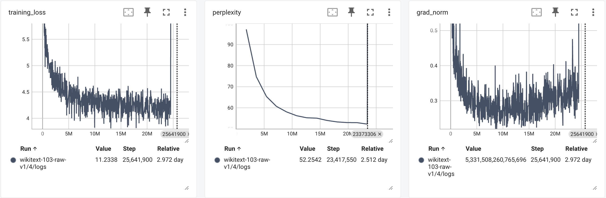
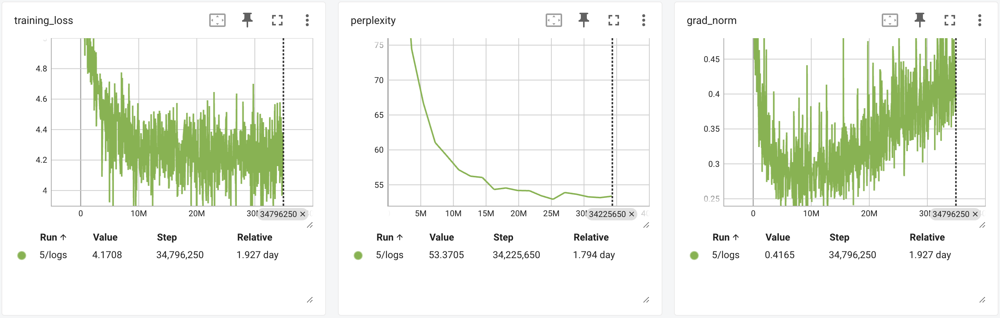

# A PyTorch Implementation of an LSTM-based Language Model

This is a PyTorch implementation of language model based on Long Short Term Memory (LSTM) model architecture.

Experiment results from 3 variants (all trained on [wikitext-103-raw-v1](https://huggingface.co/datasets/Salesforce/wikitext))
1. PyTorch's offical LSTM module + no gradient clip: hit 53.47 validation perplexity after 11 epochs (22.48 hours) of training, and then gradient exploded. 

2. Self-implemented LSTM module + no gradient clip: hit 52.25 validation perplexity aftre 13 epochs (2.5 days, much slower than PyTorch's official module), and then gradient exploded.

3. PyTorch's official LSTM module + gradient clip: hit 52.93 validatin perplexity after 14 epochs (1.3 days).

References
1. [Language Modeling with LSTMs in PyTorch](https://towardsdatascience.com/language-modeling-with-lstms-in-pytorch-381a26badcbf)
2. [Language Modelling on WikiText-103](https://paperswithcode.com/sota/language-modelling-on-wikitext-103)